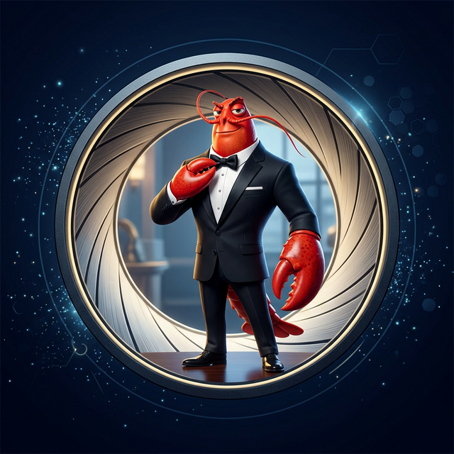

# OpenClaw 養殖與培育指南
## 會說話就能指揮！
你專屬的小龍蝦金牌特務，最懂你的數位代理人 🦞

**Author:** Alan Chang 和他的數位夥伴 Clawdbot520 聯手出版

**Version:** v1.0.0 | **Release:** 2026.03.13


**⚖️ 版權與免責聲明**
*   **版權聲明：** © 2026 Alan Chang. All rights reserved. 本書內容受著作權法保護，歡迎非商業性質的分享與個人學習使用，但未經書面授權，請勿用於任何形式的商業出版或營利行為。
*   **投資風險警告：** 本書（特別是第六章）所提及之投資分析案例僅供技術展示與教學，並不構成任何金融投資建議。AI 生成之數據可能存在「幻覺」、延遲或錯誤，投資必有風險，決策前請務必進行獨立判斷。
*   **技術時效性：** OpenClaw 系統與 AI 模型更新速度極快，書中所載之介面截圖與操作流程可能與最新版本有所差異，請以官方文檔為準。



**📖 如何閱讀本書**
*   **新手玩家：** 建議從第一章開始逐步建立觀念，並完整執行第二章的實踐安裝。
*   **進階調教：** 若你已完成安裝，可直接跳轉至第四章與第五章練習「金牌密令」的溝通藝術。
*   **尋找靈感：** 第六章提供了真實場景的自動化案例，適合想擴展特務能力的養殖大師。
*   **社群互動：** 若遇到技術卡關，歡迎至 GitHub 提交 Issue 或透過下方社群管道交流。


**歡迎大家互相交流：**
*   **Website:** [clawdbot520.fyi](https://www.clawdbot520.fyi/)
*   **Github:** [clawdbot520](https://github.com/clawdbot520/)
*   **Youtube:** [YouTube 頻道](https://www.youtube.com/channel/UCtSDbpauuSpvzudlV6ikp0g)
*   **Facebook:** [臉書專頁](https://www.facebook.com/acandy.chang/)

---

## 🦞 教官的開場白：每個人都能掌握的金牌密令

歡迎來到「龍蝦特務」的養殖場。

在打開這本書之前，請先放下你對「AI」或「寫程式」的任何恐懼。這不是一本寫給工程師看的技術指南，而是一本寫給**忙碌的上班族、需要專注學習的學童，以及所有想從瑣事中解脫的平凡大眾**的生活冒險手冊。

### 為什麼這本書不需要你懂技術？

很多人以為要操控 AI，必須先學會深奧的代碼（Code）。但在 OpenClaw 的世界裡，這個觀念是過時的。我們認為：**只要你會說話，你就能指揮特務。**

本書的核心不在於教你「硬核技術」，而在於教你一套**溝通的心法**。透過 OpenClaw 這個忠誠的翻譯官，你可以：
*   **調度資源**：不需要懂底層演算法，就能利用全球最強大的 AI 資源解決你的困難。
*   **解放雙手**：將那些枯燥、重複、消耗生命的瑣事（我們稱之為「雜魚」）交給特務處理。
*   **贖回時間**：當你不再被雜事淹沒，你才能真正擁有自己的時間，去學習、去玩耍、去陪伴愛的人。

### 核心解密：那份帶得走的指揮智慧

在接下來的章節中，我們會提到一份貫穿全書的**「金牌密令 (The Secret Order)」**。它不是什麼艱澀的檔案，而是你與特務之間達成的一種**指揮共識**。

這本書的旅程非常簡單。我們將帶你佈置一座「數位魚缸（環境）」，挑選適合的「飼料（模型）」，最後練習如何下達「密令」與「龍蝦特務（AI）」對話。

這不是在讀書，這是在學習如何與一位懂你的、有能力的、且永遠不嫌煩的「數位代理人」合作。準備好了嗎？讓我們一起跳進這片蔚藍大海，開啟屬於你的減法人生。

---

## 🗺️ 養殖大師成長路徑

### 第一章：覺醒——為什麼每個人家裡都該養隻小龍蝦？
---
*   [1.1 你的數位分身：從助理到數位代理人](1.1_你的數位分身-OpenClaw.md)
---
*   [1.2 解放雙手的金牌密令：魚缸理論](1.2_解放雙手的金牌密令.md)
--- 
*   [1.3 擺脫雜魚：養殖者的第一步](1.3_養殖者的覺醒.md)
--- 
*   [1.4 龍蝦的自我介紹：請多多指教，長官！](1.4_龍蝦的自我介紹.md)
--- 
### 第二章：環境建置——佈置你的第一座魚缸
--- 
*   [2.1 精品玻璃景觀缸：Mac 玩家實戰手冊](2.1_精品玻璃景觀缸_Mac玩家.md)
--- 
*   [2.2 都市公寓的空間魔法：Windows 玩家實戰手冊](2.2_都市公寓的空間魔法_Windows玩家.md)
--- 
*   [2.3 剪綵入住儀式：啟動、通訊與認證](2.3_剪綵入住儀式.md)
--- 

### 第三章：營養配置——挑選高品質的數位飼料
--- 
*   [3.1 認識飼料等級：你的特務大腦由誰決定？](3.1_認識飼料等級.md)
--- 
*   [3.2 龍蝦的胃口：如何預估 Token 開銷？](3.2_龍蝦的胃口.md)
--- 
*   [3.3 營養配方與省錢撇步：聰明養殖不破產](3.3_營養配方與省錢撇步.md)
--- 

### 第四章：龍蝦翻譯機——如何與 AI 特務高效溝通？
--- 
*   [4.1 翻車現場展覽館：溝通失敗的真相](4.1_翻車現場展覽館：溝通失敗的真相.md)
--- 
*   [4.2 對齊基準面：特務的四大魂核文件](4.2_對齊基準面：特務的四大魂核文件.md)
--- 
*   [4.3 指揮官的藝術：三步下令法與對應速查表](4.3_指揮官的藝術：三步下令法與對應速查表.md)
--- 

### 第五章：特務武裝——技能系統與記憶機制
--- 
*   [5.1 技能專賣店與特務裝備](5.1_技能專賣店與特務裝備.md)
--- 
*   [5.2 新手養殖週：三大實戰挑戰](5.2_新手養殖週.md)
--- 
*   [5.3 全球武器販賣商店：去市場挑選最強戰種](5.3_擴展技能樹.md)
--- 
*   [5.4 最終武裝：靈魂與記憶的深度調教](5.4_最終武裝：靈魂與記憶的深度調教.md)
--- 

### 第六章：進擊的特務——生活自動化實戰
--- 
*   [6.1 海底撈金：投資分析實務](6.1_海底撈金：投資分析實務.md)
--- 
*   [6.2 聲納捕手：龍蝦特務幫你把資訊海洋變成懶人包](6.2_聲納捕手：龍蝦特務幫你把資訊海洋變成懶人包.md)
--- 
*   [6.3 珊瑚礁指揮部：家庭成長佈告欄與孩子的 Vibe Coding 派對](6.3_珊瑚礁指揮部：家庭成長佈告欄與孩子的 Vibe Coding 派對.md)
--- 

### 第七章：加入養殖公會——一個人走快，一群人走遠
--- 
*   [7.1 深海公會探險：一個人走得快，一群人走得遠](7.1_深海公會探險：一個人走得快，一群人走得遠.md)
--- 
*   [7.2 打造你的大師標籤：進階資源與名師之路](7.2_打造你的大師標籤：進階資源與名師之路.md)
--- 
*   [7.3 龍蝦完全體出擊：最終任務由你定義](7.3_龍蝦完全體出擊：最終任務由你定義.md)
--- 

### 第八章：畢業典禮——開啟無限的人生
--- 
*   [8.1 重溫金牌密令：畢業後的檢閱](8.1_重溫金牌密令：畢業後的檢閱.md)
--- 
*   [8.2 寫給下一代的小龍蝦家長](8.2_寫給下一代的小龍蝦家長.md)
--- 
*   [8.3 門後的風景：一百種幸福人生](8.3_門後的風景：一百種幸福人生.md)
--- 

### 附錄
--- 
*   [附錄：名詞索引表](附錄_名詞索引表.md)

---
*願你的龍蝦，帶你去看更遠的海。*
