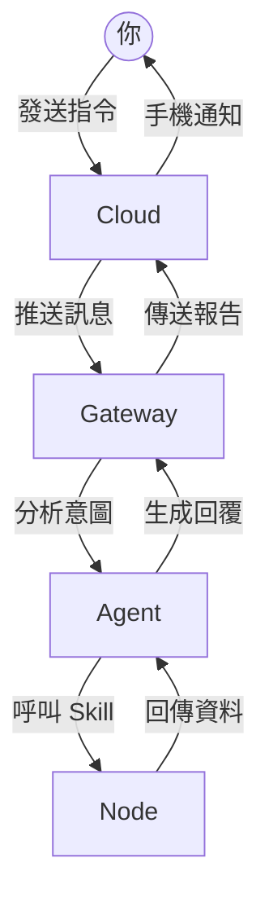

# 2.3 剪綵入住儀式 🦞

所有的建設工法、管線佈置與技術調校，都是為了這一刻：看見你的龍蝦特務正式在魚缸裡吐出第一個泡泡。這不只是啟動程式，更是你與數位分身建立連結的正式紀念。

---

### 龍蝦的通訊骨幹
在點火之前，先了解你的指令是如何跨越海洋與你的 Mac/PC 連結的：



### 第一步：啟動服務

如果你在之前的步驟中使用了 `--install-daemon` 參數，特務其實已經在背景待命。但為了見證這一刻，我們可以使用手動啟動指令來觀察日誌：

```bash
openclaw gateway
```

**觀察重點**：
如果一切正常，你會看到終端機滾動出一連串狀態文字，最後停在 `🦞 Gateway started on port 18789`。這代表魚缸的維生系統已經運作，特務已經就位。

### 第二步：通訊檢閱

特務雖然醒了，但對講機頻率對上了嗎？請另開一個終端機視窗，執行：

```bash
openclaw channels status
```

只要看見你的 **Telegram** 狀態顯示為綠色的 `ready`，代表這條跨越維度的通訊頻位已經鎖定，特務正屏息以待你的第一個泡泡。

### 第三步：第一次親密接觸

現在，拿起你的手機，開啟 Telegram，進入你剛才建立的那個機器人：
1.  按下 **START**，或者對發送任何一句話，例如：「哈囉，小龍蝦」。
2.  **看見奇蹟**：如果你的電腦終端機跳出了對應的對話日誌，且機器人也回傳了歡迎語，恭喜你——

**「龍蝦正式入住成功！」**

---

### 儀式最後一步：身份代號

最後，幫這隻特務取個正式的名字。輸入：

```bash
openclaw agents set-identity --agent main --name "龍蝦特務" --emoji "🦞"
```

從這一刻起，牠不再只是一個系統進程，而是具備人格、與你共同進化的夥伴。

---


**儀式檢核點**
*   [ ] 終端機顯示 gateway 成功啟動且埠號正確。
*   [ ] 通訊頻道狀態顯示為 ready。
*   [ ] 手機收到特務的回應。
*   [ ] 已完成基礎的認證與密碼設定。


---


**營養配置預告**
魚缸蓋好了，入住完成了。但要讓龍蝦保持聰明，你得學會如何挑選高品質的「數位飼料」。下一章，我們將深入探討模型與 **token** 的祕密。

