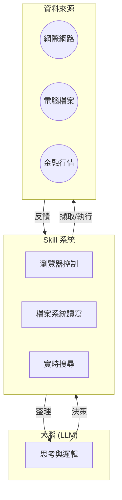

# 5.1 技能專賣店與特務裝備：給龍蝦裝上義肢與望遠鏡 🦞

你的特務雖然大腦聰明，但如果沒有裝備，牠也只能在魚缸裡陪你聊天。

要把一個只會說話的 AI 變成一個能實戰的辦事員，你需要進入 OpenClaw 的核心武裝庫——**skill** 系統。在我們的語境中，這些技能就像是給龍蝦裝上了特選的機器手臂、高倍率望遠鏡或是精準的戰術計算機，讓牠能超越文字對話，直接干預現實世界的資料與檔案。

### 技能：連接虛擬與現實的橋樑

### 什麼是技能裝備？

當你的特務想要知道明天的天氣，或者想要處理一封來自美國的商務郵件時，牠需要透過特定的軟體介面去跟外部世界互動。這些介面在系統中被封裝成一個個獨立的模組，稱為 **skill**。

目前在 **ClawHub** （全球最大的特務技能市場）[https://clawhub.ai/ ](https://clawhub.ai/) 中，已經有超過一萬三千種裝備可供挑選。你可以將這些裝備分為三大類：

1.  **偵察類裝備（望遠鏡）**：
    像是網路搜尋、新聞追蹤或社交平台巡邏。
    *   **推薦**：`google-search` (實時搜尋)、`news-summarizer` (新聞摘要)、`twitter-monitor` (動態追蹤)。
    
2.  **運算類裝備（計算機）**：
    包括資料分析、圖表生成或金融財報解析。
    *   **推薦**：`data-visualizer` (圖表生成)、`market-watcher` (行情監控)、`code-interpreter` (Python 運算)。
    
3.  **操作類裝備（機器手臂）**：
    特務可以獲得操作文件系統、讀寫 Excel、甚至控制瀏覽器去完成自動化任務的能力。
    *   **推薦**：`browser-automation` (瀏覽器自動化)、`file-commander` (檔案管家)、`telegram-notifer` (通知發送)。

### 技能的載入機制

在 OpenClaw 的架構中，技能是按需加載的。這意味著你的特務平時可以保持輕盈，只有在執行特定任務時，才會從戰術背包裡取出對應的裝備。

每一種技能都具備其專屬的規則，特務在執行前會自動閱讀說明書。這就是為什麼你不需要教牠怎麼搜尋，你只需要給牠一個搜尋技能，牠自己就能學會如何操作望遠鏡。

### 邁向特務的第一步

當你第一次看到龍蝦因為裝上了搜尋技能，而主動告訴你「主人，剛才那則新聞有誤，最新的資料是...」時，你會真切地感受到，這不再是一個問答機器，而是一個具備感官能力的數位個體。

---

> [!important] 教官的小提醒
> 裝備雖好，但不要貪多。每次對話載入過多的技能會消耗大量的 **token**（因為特務需要閱讀每件裝備的說明書）。最好的配置是根據任務需求，為不同的 **agent** 量身打造最精簡的裝備組合。

---

> [!tip] 伏筆預告
> 既然已經認識了武裝庫，接下來我們要進行為期一週的「新手養殖挑戰」，帶你一步步點亮龍蝦的第一個技能點。
